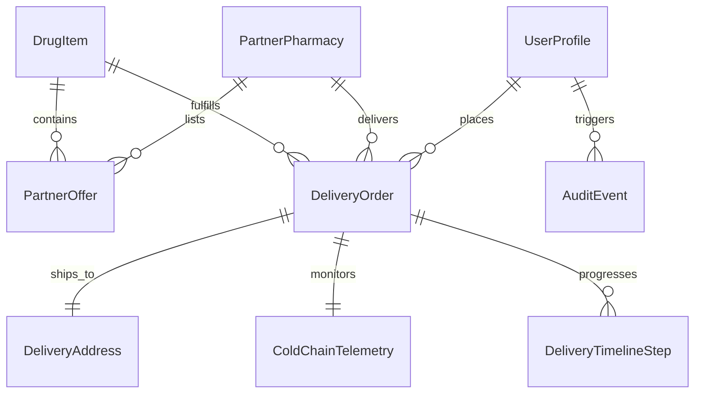

# Long-Term Project Memory — MediWise Operations

This document preserves the comprehensive architecture, domain knowledge, completed capabilities, schemas, and operational roadmaps for **MediWise Operations**. It serves as an authoritative persistent memory bank for AI coding agents and engineering teams across sessions.

---

## 1. Project Overview

**MediWise Operations** is an enterprise clinical and logistics platform designed for:
1. **Generic Medicine Discovery & Bioequivalence Parity**: Providing clinicians, pharmacists, and patients with scientifically verified generic equivalents to expensive branded medications with dissolution kinetics, Cmax, and AUC parity confidence scores.
2. **Pharmacy Partner & CPA Commission Management**: Aggregating national e-pharmacies (Tata 1mg, Apollo 24/7, Netmeds) and regional retail chains (MedPlus Health), tracking referral conversions, Gross Merchandise Value (GMV), and tiered CPA commission escrows.
3. **Regulatory Compliance & Cryptographic Audit Trails**: Delivering an immutable SHA-256 hash-chained audit ledger compliant with CDSCO directives and FDA 21 CFR Part 11.
4. **End-to-End Amazon-Style Delivery & Cold-Chain Logistics**: Tracking prescription fulfillment across priority delivery tiers with real-time IoT temperature sensor telemetry (2°C – 8°C), courier dispatch tracking, and digital proof-of-delivery signatures.
5. **Multi-Role Clinical Governance**: Enforcing role segregation across Chief Medical Information Officers (CMIO), Pharmacy Network Operators, Compliance Officers, and Patients.

---

## 2. Tech Stack Specification

| Tier / Subsystem | Technology | Version | Purpose |
| :--- | :--- | :--- | :--- |
| **Runtime & Bundler** | Vite | `^6.2.3` | High-speed ESM dev server and build tool |
| **Frontend Framework** | React | `^19.0.1` | Core reactive component framework |
| **Language** | TypeScript | `~5.8.2` | Strict static typing and interface contracts |
| **CSS & Design System** | Tailwind CSS | `^4.1.14` | High-density styling via `@tailwindcss/vite` |
| **Animation Engine** | Motion (Framer) | `^12.23.24` | Smooth transitions, modal animations, drawers |
| **Icon Systems** | Lucide React | `^0.546.0` | Modern SVG iconography |
| **Secondary Icons** | Material Symbols Outlined | Google CDN | Clinical telemetry symbols |
| **Typography** | Google Fonts | Web CDN | `Inter`, `Hanken Grotesk`, `JetBrains Mono` |
| **Backend & Execution** | Node.js + Express | `^4.21.2` | Server API proxy and webhook receiver |
| **TypeScript Runner** | `tsx` | `^4.21.0` | Node.js TypeScript execution for server tasks |
| **AI / Clinical LLM** | `@google/genai` | `^2.4.0` | Google Gemini API server-side integration |

---

## 3. Features Completed

### 3.1 Global Operations Navigation & Shell
- **Enterprise Header (`src/components/EnterpriseHeader.tsx`)**:
  - Global drug catalog search with instant typeahead filter.
  - Multi-tenant switcher: `All Tenants`, `Regional East/South`, `Operations Hub`.
  - Active actor switch between `CMIO (Dr. Vikram Rao)`, `Pharmacy Partner (Priya Sharma)`, `Compliance Officer (Elena Vance)`, and `Patient (Om Patil)`.
  - Display theme switcher: Toggle between Clinical Dark Mode (`#090d16`) and Sterile Light Mode (`#f8fafc`).
  - Session Lock trigger (`SessionLockModal`) with PIN/password re-authentication.
  - Interactive notification panel drawer with priority event alerts.
- **Rail Drawer Navigation (`src/components/RailDrawer.tsx`)**:
  - Navigation between 7 primary workspaces (`Overview`, `Catalog`, `Partners`, `Compliance`, `Deliveries`, `Patient`, `Settings`).
  - Active route highlighting, system health status indicator, and version badge (`v4.12.0`).

### 3.2 Clinical Workspaces & Screens
- **Overview Screen (`src/components/screens/OverviewScreen.tsx`)**:
  - Top-line KPIs: Total Generic Substitution Savings (in ₹), Active Formulary SKUs, Network Partner Pharmacies, Bioequivalence Pass Rate (99.2%).
  - Savings distribution graph across therapeutic categories (Cardiology, Endocrinology, Gastroenterology, Anti-infective, Respiratory).
  - Live Event Bus stream displaying inbound webhook payloads, prescription verifications, and pricing adjustments.
- **Drug Catalog Screen (`src/components/screens/DrugCatalogScreen.tsx`)**:
  - Interactive comparative table: Branded Originator vs. Generic Equivalent.
  - Deep pharmacology metrics: Dissolution kinetics (`USP >85% @ 30m`), Cmax Parity, AUC Parity, ATC Codes, CAS numbers, molecular formulas, and SMILES notation.
  - Clinical sign-off verification hash and medical lead credentialing.
  - Live partner pharmacy stock availability and direct "Order Delivery" launcher.
- **Partner Network Screen (`src/components/screens/PartnerNetworkScreen.tsx`)**:
  - Grid of integrated national and regional partners: Apollo 24/7, Tata 1mg, Netmeds, MedPlus Health.
  - Connection protocol badges: Kafka Event Stream, REST Webhook / FHIR, Daily SFTP Batch.
  - Commercial metrics: Referral clicks, Conversion Rate (CVR %), GMV generated (₹), and accrued CPA commissions.
  - Tiered commission structure badges (`Tier 1 - 8.5%`, `Tier 2 - 7.0%`, `Tier 3 - ₹20`).
- **Compliance Screen (`src/components/screens/ComplianceScreen.tsx`)**:
  - Cryptographic audit trail with SHA-256 block hash anchors.
  - Actor role stamps (`CLINICAL_LEAD`, `SYSTEM_BOT`, `PHARMACY_WEBHOOK`, `SUPER_ADMIN`).
  - Visual payload diff viewer displaying modified, added, and preserved keys.
  - Emergency formulary override trigger and production configuration rollback tools.
- **Delivery Management Screen (`src/components/screens/DeliveryManagementScreen.tsx`)**:
  - Amazon-style shipment tracker with status filters (`All`, `Out for Delivery`, `In Transit`, `Delivered`, `Delayed`).
  - IoT cold-chain sensor status cards: Live Celsius readout, target threshold (2°C – 8°C), and FIPS-140 seal integrity.
  - Interactive multi-step timeline tracking (Doctor verification → Warehouse pick → Cold-chain pack → Courier dispatch → Doorstep delivery).
  - Direct actions: View live tracker modal, contact courier, verify delivery OTP.
- **Patient Portal Screen (`src/components/screens/PatientPortalScreen.tsx`)**:
  - Prescription slip upload and doctor signature verification.
  - Generic cost comparison calculator with monthly and annual projected savings.
  - One-click prescription order placement.
- **System Settings Screen (`src/components/screens/SettingsScreen.tsx`)**:
  - Core system configuration editor: Cluster environment, Kubernetes discovery namespace, RabbitMQ exchange, Redis shard topology, and bioequivalence confidence floors.
  - External Service Gateway matrix: Stripe Connect, Cloudflare WAF, Twilio OTP, SendGrid Mailer, RxNorm API, and AWS S3 Vault.
  - Configuration diff and instant rollback rollback tools.

### 3.3 Interactive Modals
- `DeliveryTrackingModal.tsx`: Real-time map simulation, stops-away counter, cold-chain sensor gauge, courier details, and signature proof.
- `OrderDeliveryModal.tsx`: Multi-step checkout with delivery speed selector, cold-chain toggle, address selection, and price summary.
- `ConfigDiffModal.tsx`: Side-by-side JSON comparison of pending cluster and bioequivalence changes.
- `RollbackModal.tsx`: Authorize snapshot restore with administrative dual-key approval.
- `EmergencyOverrideModal.tsx`: Clinical bypass workflow with mandatory audit reason logging.
- `DoctorSlipModal.tsx`: Digital medical prescription verification viewer.
- `SessionLockModal.tsx`: HIPAA compliant screen lock overlay.
- `AuthModal.tsx` & `GoogleOAuthModal.tsx`: Multi-provider authentication and profile management.
- `ProfileSettingsModal.tsx`: Professional licensing, 2FA configuration, and session security.
- `TermsModal.tsx`: Regulatory terms and HIPAA BAA agreement viewer.

---

## 4. Pending Features

| Feature | Priority | Complexity | Target Area |
| :--- | :--- | :--- | :--- |
| **Real-time WebSocket Gateway** | High | Medium | `src/data/` & Express backend |
| **Interactive Rx AI Scanner (Gemini Vision)** | High | High | `src/components/screens/PatientPortalScreen.tsx` |
| **PDF Prescription & Clinical Slip Export** | Medium | Low | `src/components/modals/DoctorSlipModal.tsx` |
| **Live Courier Geolocation Map (Leaflet / Mapbox)** | Medium | Medium | `src/components/modals/DeliveryTrackingModal.tsx` |
| **Stripe Connect Automated Escrow Payouts** | Low | High | External Service Gateway |

---

## 5. API Endpoints & Gateway Architecture

### 5.1 Internal Platform Endpoints (Express / Client Contracts)

```http
### Drugs & Bioequivalence
GET    /api/drugs                  # Retrieve all active formulary items
GET    /api/drugs/:id              # Retrieve granular drug monograph and bioequivalence data
POST   /api/drugs/parity-check     # Calculate AUC/Cmax bioequivalence confidence score

### Pharmacy Partners & CPA
GET    /api/partners               # Retrieve partner registry, sync status, and GMV
POST   /api/partners/:id/sync      # Trigger manual webhook/SFTP inventory sync
GET    /api/partners/commissions   # Export monthly CPA commission breakdown

### Deliveries & Logistics
GET    /api/deliveries             # List active and past delivery orders
POST   /api/deliveries/order       # Place new prescription fulfillment order
GET    /api/deliveries/:id/track   # Retrieve real-time timeline, courier location, & sensor data
PATCH  /api/deliveries/:id/temp    # Ingest IoT cold-chain sensor temperature heartbeat

### Compliance & Audit
GET    /api/compliance/ledger      # Retrieve SHA-256 anchored audit events
POST   /api/compliance/override    # Execute signed emergency clinical override
POST   /api/compliance/rollback    # Rollback system config to historical snapshot
```

### 5.2 External Integrated Service Gateways

| Code | Name | Endpoint / Protocol | Auth Protocol | Function |
| :--- | :--- | :--- | :--- | :--- |
| **ST** | Stripe Connect Payout API | `api.stripe.com/v1/transfers` | Bearer TLS 1.3 Webhook | Escrow settlement & partner CPA payouts |
| **CF** | Cloudflare WAF & DDoS | `api.cloudflare.com/client/v4` | SSL Strict Full SNI | Rate limiting, bot shield, DDoS defense |
| **TW** | Twilio Telephony Dispatcher | `api.twilio.com/2010-04-01/...` | HTTP Basic / Sid HMAC | 2FA OTP codes & delivery SMS notifications |
| **SG** | SendGrid Transactional | `api.sendgrid.com/v3/mail/send` | SPF / DKIM / DMARC | Doctor slip disclosures & audit summaries |
| **RX** | RxNorm & CDSCO NDC Database| `rxnav.nlm.nih.gov/REST/ndc` | mTLS Federal Cert | Daily pharmaceutical master catalog sync |
| **S3** | AWS S3 Vault Document Store| `s3.us-east-1.amazonaws.com/...` | IAM Role ARN (SSE-KMS) | Bioequivalence clinical trial dossier storage |

---

## 6. Database Schema Summary

The domain model is defined in `src/types.ts`. Key entity relationships are summarized below:



### 6.1 Core Entities

#### `DrugItem`
- `id` (string, PK)
- `brandName` / `brandManufacturer` / `brandNdc` / `brandPrice` (number in ₹)
- `activeSalt` / `strength` / `dosageForm` / `atcCode` / `casNumber`
- `genericPriceAvg` / `savingsPercent` / `savingsAmount`
- `parityPercent` / `cmaxParity` / `aucParity` / `dissolutionStatus`
- `molecularFormula` / `smiles` / `molecularWeight` / `bioavailability`
- `category` ('Cardiology' | 'Endocrinology' | 'Gastroenterology' | 'Anti-infective' | 'Respiratory')
- `clinicalSignOff`: `{ doctor, role, date, hash }`
- `partnerOffers`: Array of `{ partnerName, price, savingsRate, delivery, status }`

#### `PartnerPharmacy`
- `id` (string, PK), `name`, `code`, `category` ('national' | 'regional' | 'local')
- `protocol` ('Kafka Event Stream' | 'REST Webhook / FHIR' | 'Daily SFTP Batch' | 'Direct POS')
- `feedStatus` ('live' | 'active' | 'synced' | 'warning')
- `referralClicks`, `cvrPercent`, `gmvAmount` (₹), `cpaAccrued` (₹)
- `cpaTier` ('Tier 1 (8.5%)' | 'Tier 2 (7.0%)' | 'Tier 3 (₹20)')

#### `DeliveryOrder`
- `id` (string, PK), `orderNumber`, `trackingNumber`
- `drugId`, `drugName`, `activeSalt`, `dosageForm`, `quantity`
- `pharmacyPartner`, `carrier`
- `deliverySpeed` ('same_day' | 'next_day' | 'standard' | 'express_cold_chain' | 'in_store_pickup')
- `status` ('order_placed' | 'pharmacist_verified' | 'in_transit' | 'out_for_delivery' | 'delivered' | 'delayed')
- `orderDate`, `expectedDeliveryDate`, `expectedDeliveryTimeWindow`
- `unitPrice`, `totalPrice`, `savingsAmount`, `shippingFee` (in ₹)
- `coldChain`: `{ required: boolean, currentTempCelsius: number, targetRange: string, sensorStatus: 'optimal' | 'warning' | 'critical', fipsSealNumber: string }`
- `courier`: `{ name, phone, vehicle, stopsAway, currentLocationName, rating }`
- `timeline`: Array of `DeliveryTimelineStep` `{ step, label, timestamp, location, completed, isCurrent }`
- `deliveryAddress`: `DeliveryAddress` `{ recipientName, street, aptSuite, city, state, zipCode, phone, instructions }`

#### `AuditEvent`
- `id` (string, PK), `timestamp`, `hash` (SHA-256)
- `actor`, `actorRole` ('CLINICAL_LEAD' | 'SYSTEM_BOT' | 'PHARMACY_WEBHOOK' | 'SUPER_ADMIN')
- `action`, `resource`, `complianceCode`, `ip`
- `status` ('Verified Pass' | 'Action Required' | 'Flagged WAF')
- `payloadDiff`: `{ removed: string[], added: string[], preserved: string[] }`

---

## 7. Important Business Logic Rules

1. **Bioequivalence Acceptance Boundary**:
   - Any generic drug must demonstrate a minimum bioequivalence parity confidence of **98.00%** (`bioeqConfidenceFloor: 0.9800`) to be approved for one-click doctor substitution.
   - Cmax parameter variation must stay within **±5.0%** (`bioeqCmaxToleranceBand: 0.050`).
2. **Cold-Chain Environmental Rules**:
   - For all temperature-sensitive biological drugs, current temperature must remain between **2.0°C and 8.0°C**.
   - If current temperature reaches `< 1.8°C` or `> 8.2°C`, `sensorStatus` shifts to `'warning'`.
   - If temperature exceeds `10.0°C` or falls below `0.0°C`, `sensorStatus` triggers `'critical'`, an immediate courier alert is dispatched, and delivery is placed on clinical hold.
3. **CPA Commission Accrual Calculation**:
   - `Tier 1`: Accrues `8.5%` of GMV upon verified delivery order completion.
   - `Tier 2`: Accrues `7.0%` of GMV upon verified delivery order completion.
   - `Tier 3`: Accrues flat `₹20.00` per processed unit.
4. **Audit Hash-Chain Invariance**:
   - Event hashes are generated using `SHA256(previousHash + eventId + timestamp + actorRole + action + stringify(payloadDiff))`.
   - If an event is inserted out of chronological order, the hash-chain is marked broken (`statusType: 'error'`).

---

## 8. Known Issues & Operational Considerations

1. **Vite HMR in Specialized Container Sandboxes**:
   - `vite.config.ts` includes `hmr: process.env.DISABLE_HMR !== 'true'`. In certain automated cloud coding sandboxes where `DISABLE_HMR` is active, hot updates require manual browser reloads.
2. **State Ephemerality**:
   - In-memory modifications (e.g., adding a new delivery or toggling partner sync) reset on browser hard refresh, except for `theme` which is persisted in `localStorage`. Long-term persistence requires connecting to a SQLite / PostgreSQL backend.
3. **Currency Conversion Display**:
   - All monetary figures are currently in INR (`₹`). International NDC imports require conversion at the exchange gateway layer before insertion into the catalog.

---

## 9. Future Roadmap

### Phase 1: Near-Term (Sprint Q4 2026)
- [ ] Connect Gemini 2.5 Flash multimodal vision API for prescription handwriting OCR.
- [ ] Implement client-side PDF rendering for official doctor substitution slips.
- [ ] Persist mock mutations into an IndexedDB / SQLite browser database.

### Phase 2: Medium-Term (Sprint Q1 2027)
- [ ] Direct FHIR v4.0 / HL7 webhook ingestion from hospital Electronic Health Record (EHR) systems.
- [ ] Integration with India Stack: Ayushman Bharat Digital Mission (ABDM) and Unified Health Interface (UHI).
- [ ] Live BLE beacon telemetry for refrigerated pharmacy van fleet tracking.

### Phase 3: Long-Term (Sprint Q2 2027)
- [ ] Automated smart-contract escrow settlement on Stripe Connect with GST tax invoice generation.
- [ ] Multi-region federated catalog synchronizing CDSCO, FDA Orange Book, and EMA generic registrations.
