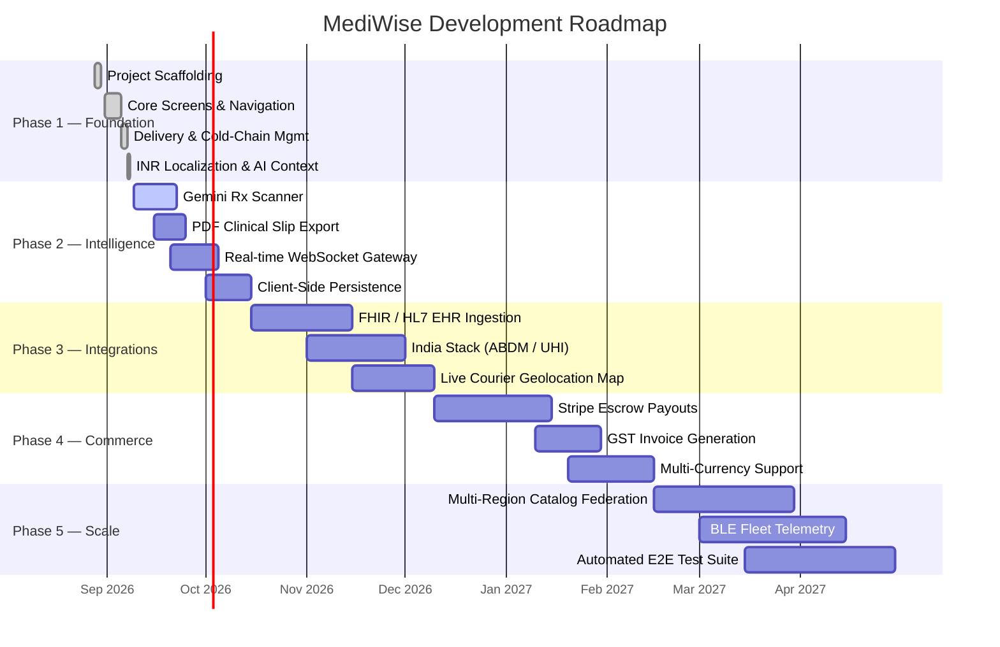
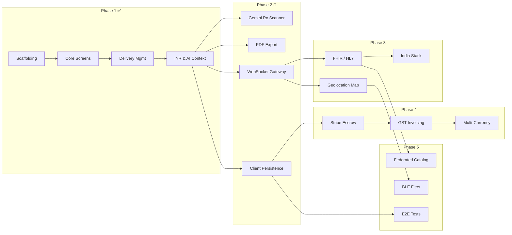

# Development Phases — MediWise Operations

This document defines the complete phased development roadmap for **MediWise Operations**. Each phase is broken into milestones with concrete deliverables, success criteria, dependencies, and ownership areas. AI coding assistants must reference this document when planning new features, estimating scope, or prioritizing backlog items.

> [!NOTE]
> **Current Status**: Phase 1 is **complete**. Phase 2 is **in progress** (Sprint 2.1 active as of September 2026). Phases 3–5 are planned.

---

## Phase Overview

---

## Phase 1: Foundation & Core Platform ✅ COMPLETE

**Timeline**: August 28 – September 8, 2026
**Version Range**: `v0.1.0` → `v1.2.0`
**Objective**: Build the production-ready clinical operations shell with all primary workspaces, multi-role governance, delivery logistics, and AI-ready persistent context.

### Sprint 1.1 — Project Scaffolding & Design System `v0.1.0`

| Deliverable | Status | File(s) |
| :--- | :--- | :--- |
| Vite 6 + React 19 + TypeScript 5.8 project initialization | ✅ Done | `package.json`, `vite.config.ts`, `tsconfig.json` |
| Tailwind CSS v4 integration via `@tailwindcss/vite` | ✅ Done | `vite.config.ts`, `src/index.css` |
| Google Fonts stack (`Inter`, `Hanken Grotesk`, `JetBrains Mono`) | ✅ Done | `index.html` |
| Clinical Dark Mode (`#090d16`) & Sterile Light Mode (`#f8fafc`) | ✅ Done | `src/index.css` |
| Material Symbols Outlined icon set | ✅ Done | `index.html` |
| HTML5 shell with SEO meta tags | ✅ Done | `index.html` |
| Environment variable template | ✅ Done | `.env.example` |

### Sprint 1.2 — Core Screens, Shell & Governance `v1.0.0`

| Deliverable | Status | File(s) |
| :--- | :--- | :--- |
| Enterprise Header (search, tenant switcher, role selector, theme toggle) | ✅ Done | `src/components/EnterpriseHeader.tsx` |
| Rail Drawer navigation (7 primary workspaces) | ✅ Done | `src/components/RailDrawer.tsx` |
| Notification toast system | ✅ Done | `src/components/NotificationToast.tsx` |
| Overview Screen (KPIs, savings distribution, Event Bus) | ✅ Done | `src/components/screens/OverviewScreen.tsx` |
| Drug Catalog Screen (bioequivalence parity, molecular data) | ✅ Done | `src/components/screens/DrugCatalogScreen.tsx` |
| Partner Network Screen (CPA commissions, sync protocols) | ✅ Done | `src/components/screens/PartnerNetworkScreen.tsx` |
| Compliance Screen (hash-chain audit ledger, payload diffs) | ✅ Done | `src/components/screens/ComplianceScreen.tsx` |
| Patient Portal Screen (Rx upload, savings calculator) | ✅ Done | `src/components/screens/PatientPortalScreen.tsx` |
| Settings Screen (cluster config, service gateways) | ✅ Done | `src/components/screens/SettingsScreen.tsx` |
| Auth Screen (multi-role onboarding) | ✅ Done | `src/components/screens/AuthScreen.tsx` |
| RBAC with 4 distinct roles (CMIO, Pharmacy, Compliance, Patient) | ✅ Done | `src/data/mockUsers.ts`, `src/types.ts` |
| 11 interactive governance modals | ✅ Done | `src/components/modals/*` |
| Centralized domain type contracts (260 lines) | ✅ Done | `src/types.ts` |
| Mock data fixtures (drugs, partners, audit events, configs) | ✅ Done | `src/data/mockData.ts` |

### Sprint 1.3 — Delivery Management & Cold-Chain `v1.1.0`

| Deliverable | Status | File(s) |
| :--- | :--- | :--- |
| Delivery Management Screen (Amazon-style status filters) | ✅ Done | `src/components/screens/DeliveryManagementScreen.tsx` |
| Delivery Tracking Modal (timeline, courier, cold-chain gauge) | ✅ Done | `src/components/modals/DeliveryTrackingModal.tsx` |
| Order Delivery Modal (multi-step checkout, speed selector) | ✅ Done | `src/components/modals/OrderDeliveryModal.tsx` |
| IoT Cold-Chain telemetry (2°C–8°C sensor, FIPS-140 seal) | ✅ Done | `src/types.ts`, `src/data/mockDeliveries.ts` |
| Mock delivery fixtures (3 active orders with full timelines) | ✅ Done | `src/data/mockDeliveries.ts` |

### Sprint 1.4 — Localization & AI Context `v1.2.0`

| Deliverable | Status | File(s) |
| :--- | :--- | :--- |
| INR (₹) currency localization across all financial displays | ✅ Done | All screens & modals |
| Tiered CPA commission model (8.5% / 7.0% / ₹20 flat) | ✅ Done | `src/data/mockData.ts` |
| Persistent AI context files (`decisions.md`, `rules.md`, `memory.md`, `changelog.md`) | ✅ Done | Project root |
| Server-Side Gemini API capability declaration | ✅ Done | `metadata.json` |

---

## Phase 2: Intelligence & Real-Time Capabilities 🔄 IN PROGRESS

**Timeline**: September 9 – October 15, 2026
**Version Range**: `v1.3.0` → `v1.6.0`
**Objective**: Add AI-powered clinical intelligence, real-time communication infrastructure, exportable clinical documents, and client-side data persistence.

### Sprint 2.1 — Gemini Rx Prescription Scanner `v1.3.0`

> **Priority**: 🔴 High &nbsp;&nbsp;|&nbsp;&nbsp; **Complexity**: High &nbsp;&nbsp;|&nbsp;&nbsp; **Depends on**: `@google/genai` SDK, Express server proxy

| Deliverable | Status | Target File(s) |
| :--- | :--- | :--- |
| Express API endpoint: `POST /api/rx/scan` (Gemini Vision multimodal) | ⬜ Pending | `server.ts` (new) |
| Prescription image upload UI with drag-and-drop zone | ⬜ Pending | `src/components/screens/PatientPortalScreen.tsx` |
| AI-extracted fields: drug name, dosage, physician name, Schedule H/X flag | ⬜ Pending | `src/types.ts` (new `RxScanResult` type) |
| Automatic generic substitution suggestions from scanned Rx | ⬜ Pending | `src/components/screens/PatientPortalScreen.tsx` |
| Clinical safety system prompt with hallucination guardrails | ⬜ Pending | `server.ts` |
| Error states: blur detection, unreadable handwriting, missing fields | ⬜ Pending | UI components |

**Success Criteria**:
- [ ] User can photograph or upload a handwritten prescription image.
- [ ] Gemini Vision extracts the drug name and dosage with ≥90% accuracy on clear images.
- [ ] Extracted drug automatically cross-references the formulary to suggest generic alternatives.
- [ ] All AI calls are proxied through the Express server; no API key exposed to client.

### Sprint 2.2 — PDF Clinical Slip Export `v1.4.0`

> **Priority**: 🟡 Medium &nbsp;&nbsp;|&nbsp;&nbsp; **Complexity**: Low &nbsp;&nbsp;|&nbsp;&nbsp; **Depends on**: None (client-side only)

| Deliverable | Status | Target File(s) |
| :--- | :--- | :--- |
| Client-side PDF generation library integration (`jspdf` or `@react-pdf/renderer`) | ⬜ Pending | `package.json` |
| Doctor substitution slip template with institutional letterhead | ⬜ Pending | New utility / component |
| Fields: Patient name, original Rx, generic substitute, bioequivalence confidence, physician sign-off hash | ⬜ Pending | Modal or screen component |
| Download button in `DoctorSlipModal` with filename format `MediWise_Rx_Slip_{orderNumber}_{date}.pdf` | ⬜ Pending | `src/components/modals/DoctorSlipModal.tsx` |

**Success Criteria**:
- [ ] PDF downloads cleanly in all major browsers (Chrome, Firefox, Safari, Edge).
- [ ] The generated PDF contains all legally required clinical disclosure fields.
- [ ] Bioequivalence parity confidence score is prominently displayed.

### Sprint 2.3 — Real-Time WebSocket Gateway `v1.5.0`

> **Priority**: 🔴 High &nbsp;&nbsp;|&nbsp;&nbsp; **Complexity**: Medium &nbsp;&nbsp;|&nbsp;&nbsp; **Depends on**: Express server

| Deliverable | Status | Target File(s) |
| :--- | :--- | :--- |
| WebSocket server (`ws` or `socket.io`) integrated with Express | ⬜ Pending | `server.ts` |
| Client-side WebSocket hook (`useWebSocket`) | ⬜ Pending | `src/hooks/useWebSocket.ts` (new) |
| Live Event Bus stream (replace polling simulation) | ⬜ Pending | `src/components/screens/OverviewScreen.tsx` |
| Real-time delivery status push updates | ⬜ Pending | `src/components/screens/DeliveryManagementScreen.tsx` |
| Partner pharmacy inventory sync heartbeat | ⬜ Pending | `src/components/screens/PartnerNetworkScreen.tsx` |
| Cold-chain temperature sensor live stream | ⬜ Pending | `src/components/modals/DeliveryTrackingModal.tsx` |
| Connection status indicator in header (connected / reconnecting / disconnected) | ⬜ Pending | `src/components/EnterpriseHeader.tsx` |

**Success Criteria**:
- [ ] Event Bus logs appear in real-time without manual refresh.
- [ ] Delivery status transitions push to all connected clients within 500ms.
- [ ] Graceful reconnection with exponential backoff on network interruption.

### Sprint 2.4 — Client-Side Data Persistence `v1.6.0`

> **Priority**: 🟡 Medium &nbsp;&nbsp;|&nbsp;&nbsp; **Complexity**: Medium &nbsp;&nbsp;|&nbsp;&nbsp; **Depends on**: None

| Deliverable | Status | Target File(s) |
| :--- | :--- | :--- |
| IndexedDB abstraction layer (`idb` or `dexie`) | ⬜ Pending | `src/lib/db.ts` (new) |
| Persist drug catalog modifications across browser sessions | ⬜ Pending | `src/data/` integration |
| Persist delivery order state and timeline progression | ⬜ Pending | `src/data/` integration |
| Persist audit ledger entries locally | ⬜ Pending | `src/data/` integration |
| Data migration and schema versioning strategy | ⬜ Pending | `src/lib/db.ts` |
| "Clear Local Data" option in Settings | ⬜ Pending | `src/components/screens/SettingsScreen.tsx` |

**Success Criteria**:
- [ ] User creates a delivery order → refreshes browser → order persists.
- [ ] Theme preference, catalog edits, and audit logs survive hard reloads.
- [ ] IndexedDB schema auto-migrates on version bumps without data loss.

---

## Phase 3: Healthcare Ecosystem Integrations

**Timeline**: October 15 – December 10, 2026
**Version Range**: `v2.0.0` → `v2.3.0`
**Objective**: Connect MediWise into the broader healthcare interoperability ecosystem—hospital EHR systems, India's national digital health infrastructure, and live geolocation services.

### Sprint 3.1 — FHIR v4.0 / HL7 EHR Ingestion `v2.0.0`

> **Priority**: 🔴 High &nbsp;&nbsp;|&nbsp;&nbsp; **Complexity**: High &nbsp;&nbsp;|&nbsp;&nbsp; **Depends on**: Express server, WebSocket gateway

| Deliverable | Description |
| :--- | :--- |
| FHIR R4 MedicationRequest resource parser | Ingest structured prescriptions from hospital EHR systems via FHIR R4 bundles |
| Webhook receiver: `POST /api/fhir/ingest` | Accept HL7 FHIR JSON payloads from registered EHR endpoints |
| Automatic formulary cross-reference | Map FHIR medication codes (RxNorm / SNOMED CT) to MediWise `DrugItem` catalog |
| Patient record linking (de-identified) | Associate ingested prescriptions with platform patient profiles using ABDM Health IDs |
| FHIR compliance validation middleware | Reject malformed bundles and log compliance violations to the audit ledger |

**Key Dependencies**:
- FHIR R4 specification: `hl7.org/fhir/R4`
- SNOMED CT → ATC code mapping tables
- Hospital partner sandbox environments for integration testing

### Sprint 3.2 — India Stack Integration (ABDM / UHI) `v2.1.0`

> **Priority**: 🟡 Medium &nbsp;&nbsp;|&nbsp;&nbsp; **Complexity**: High &nbsp;&nbsp;|&nbsp;&nbsp; **Depends on**: FHIR ingestion, government sandbox credentials

| Deliverable | Description |
| :--- | :--- |
| ABHA (Ayushman Bharat Health Account) ID verification | Authenticate patients using India's national Health ID system |
| Health Information Exchange (HIE) consent gateway | Implement patient consent flows for sharing health records across providers |
| UHI (Unified Health Interface) service discovery | Enable patients to discover nearby pharmacies and teleconsultation providers via UHI protocol |
| Digital Health Locker integration | Pull and push prescription records from the patient's national Digital Health Locker |

### Sprint 3.3 — Live Courier Geolocation Map `v2.2.0`

> **Priority**: 🟡 Medium &nbsp;&nbsp;|&nbsp;&nbsp; **Complexity**: Medium &nbsp;&nbsp;|&nbsp;&nbsp; **Depends on**: WebSocket gateway, mapping library

| Deliverable | Description |
| :--- | :--- |
| Leaflet.js or Mapbox GL integration | Embed interactive vector map in `DeliveryTrackingModal` |
| Real-time courier pin with heading indicator | Show courier location updating every 5 seconds via WebSocket |
| Route polyline with ETA recalculation | Display planned delivery route with dynamic estimated arrival |
| Pharmacy pickup location markers | Show partner pharmacy locations with operating hours and stock status |
| Geofence arrival alert | Trigger "Courier is nearby" notification when within 500m of delivery address |

---

## Phase 4: Commerce & Financial Settlement

**Timeline**: December 10, 2026 – February 15, 2027
**Version Range**: `v3.0.0` → `v3.3.0`
**Objective**: Automate financial flows—CPA commission payouts, tax-compliant invoice generation, and multi-currency support for cross-border operations.

### Sprint 4.1 — Stripe Connect Automated Escrow Payouts `v3.0.0`

> **Priority**: 🟡 Medium &nbsp;&nbsp;|&nbsp;&nbsp; **Complexity**: High

| Deliverable | Description |
| :--- | :--- |
| Stripe Connect account onboarding for pharmacy partners | Guide partners through Stripe identity verification and bank account linking |
| Automated CPA escrow settlement engine | Release accrued commissions on verified delivery completion per tier rules |
| Webhook handler: `POST /api/stripe/webhook` | Process Stripe events (payout succeeded, failed, disputed) |
| Partner payout dashboard | Show settlement history, pending amounts, and payout schedule per partner |
| Dual-authorization payout release | Require CMIO + Compliance Officer approval for payouts exceeding ₹1,00,000 |

### Sprint 4.2 — GST Tax Invoice Generation `v3.1.0`

> **Priority**: 🟡 Medium &nbsp;&nbsp;|&nbsp;&nbsp; **Complexity**: Medium

| Deliverable | Description |
| :--- | :--- |
| GST-compliant invoice template (GSTIN, HSN codes, IGST/CGST/SGST breakdown) | Generate legally valid invoices for Indian B2B pharmacy transactions |
| Automated invoice numbering with financial year sequencing | `MW/2026-27/INV-00001` format |
| PDF invoice generation and email delivery via SendGrid | Automatic dispatch to partner billing contacts on settlement |
| GST filing export (JSON format compatible with GST portal bulk upload) | Monthly export for partner accountants |

### Sprint 4.3 — Multi-Currency Support `v3.2.0`

> **Priority**: 🟢 Low &nbsp;&nbsp;|&nbsp;&nbsp; **Complexity**: Medium

| Deliverable | Description |
| :--- | :--- |
| Currency configuration in user/tenant settings | Allow switching display currency (INR, USD, GBP, EUR, AED) |
| Exchange rate API integration (Open Exchange Rates / ECB) | Daily rate refresh for cross-border drug price comparisons |
| Dual-currency display on Drug Catalog | Show both local currency and INR reference price side by side |
| CPA commission calculation in partner's local currency | Settle commissions in the currency of the partner's Stripe account |

---

## Phase 5: Scale, Reliability & Global Expansion

**Timeline**: February 15 – April 30, 2027
**Version Range**: `v4.0.0` → `v4.3.0`
**Objective**: Harden the platform for multi-region operations, introduce automated testing infrastructure, and scale logistics telemetry.

### Sprint 5.1 — Multi-Region Federated Drug Catalog `v4.0.0`

> **Priority**: 🔴 High &nbsp;&nbsp;|&nbsp;&nbsp; **Complexity**: High

| Deliverable | Description |
| :--- | :--- |
| Federated catalog schema supporting CDSCO (India), FDA Orange Book (US), and EMA (EU) registrations | Unified drug model with region-specific regulatory metadata |
| Regulatory approval status badges per jurisdiction | Display `CDSCO Approved`, `FDA ANDA`, `EMA Centralised` per drug |
| Cross-region bioequivalence data harmonization | Merge dissolution, Cmax, AUC studies from multiple regulatory databases |
| Region-aware partner pharmacy filtering | Show only pharmacies licensed in the patient's jurisdiction |

### Sprint 5.2 — BLE Fleet Telemetry & IoT Expansion `v4.1.0`

> **Priority**: 🟡 Medium &nbsp;&nbsp;|&nbsp;&nbsp; **Complexity**: High

| Deliverable | Description |
| :--- | :--- |
| BLE beacon protocol for refrigerated pharmacy delivery vans | Track cold-chain compliance across fleet vehicles in real-time |
| Temperature anomaly detection with ML threshold model | Predict cold-chain breaches 15 minutes before they occur |
| Fleet dashboard in Operations workspace | Show all active delivery vehicles, routes, temperatures, and alerts |
| Historical temperature compliance reports | Export per-delivery cold-chain logs for regulatory audit submissions |

### Sprint 5.3 — Automated End-to-End Test Suite `v4.2.0`

> **Priority**: 🟡 Medium &nbsp;&nbsp;|&nbsp;&nbsp; **Complexity**: Medium

| Deliverable | Description |
| :--- | :--- |
| Playwright E2E test infrastructure | Browser automation tests covering all 7 screen workspaces |
| Critical user journey tests | Login → Search Drug → View Bioequivalence → Place Order → Track Delivery |
| RBAC permission boundary tests | Verify each role can only access permitted screens and actions |
| Theme toggle regression tests | Ensure no contrast violations or unreadable text in either theme |
| CI pipeline integration (GitHub Actions) | Run full E2E suite on every pull request |

---

## Phase Dependency Graph

---

## Cross-Cutting Concerns (All Phases)

These are ongoing responsibilities that apply across every phase and sprint:

| Concern | Rule |
| :--- | :--- |
| **Type Safety** | Every new feature must add or extend types in `src/types.ts`. Zero `any` tolerance. |
| **Audit Logging** | Every state mutation touching clinical data, financial figures, or configuration must generate an `AuditEvent`. |
| **Theme Parity** | Every new UI component must render correctly in both Clinical Dark Mode and Sterile Light Mode. |
| **Currency Consistency** | All new financial displays default to INR (`₹`) until Phase 4.3 introduces multi-currency. |
| **Documentation** | Update `memory.md`, `changelog.md`, and `decisions.md` after completing each sprint. |
| **Security** | No secrets in git. No client-side API key exposure. Sanitize all user inputs. |
| **Accessibility** | Maintain WCAG 2.1 AA contrast ratios. Ensure keyboard navigation for all modals. |
